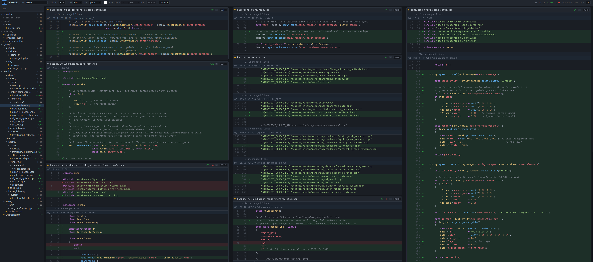

# diffwall



A local, browser-based, read-only diff wall. Shows every changed file in a git
repo as a pane, tiled across a large screen, refreshing itself while coding
agents work. The server can run locally on Windows, Linux, or macOS, and can
also run in a VS Code Remote SSH workspace.

Read-only: it reads git and the working tree and never writes to the repo. It is
immune to *how* an edit was made — `sed`, a heredoc, an editor, or an agent all
show up identically, and untracked files appear without `git add`.

## Requirements

- **Node 20+** (pinned in `.nvmrc` and `engines`). Use `nvm use` to match.
- `git` on `PATH`.
- Windows, Linux, or macOS.

## Install

Exact, reproducible install from a clean checkout:

```bash
nvm use            # or otherwise ensure Node 20+
npm ci             # NOT `npm install` — ci fails if the lockfile disagrees
npm run build      # builds server (tsc) and web (vite)
```

`.npmrc` sets `save-exact=true` and `ignore-scripts=true`; all versions are
pinned exactly and `package-lock.json` is committed. No package requires a
postinstall script.

## Run

From anywhere inside a git repository:

```bash
node dist/server/index.js [options]      # after `npm run build`
```

Options:

```
--repo <path>        repository to display (default: current directory)
--base <ref>        base to diff against (default HEAD = uncommitted changes)
--port <n>          default 7777
--interval <ms>     poll interval hint for the UI (default 2000)
--context <n>       diff context lines (default 3)
--no-untracked      hide untracked files
--theme <name>      one-dark-pro (default), github-dark, github-light
--open              open the browser via the platform default
```

The server binds `127.0.0.1` only and makes no outbound requests at runtime.

Use `--repo` when the launcher is not started from the repository:

```bash
node dist/server/index.js --repo /work/folder_1 --port 7001
```

On a remote SSH host, omit `--open` and forward the port to your local
machine instead.

## Windows deployment

Install Node 20+, Git, and a built copy of diffwall:

```powershell
git clone https://github.com/thvaisa/diffwall.git C:\Tools\diffwall
cd C:\Tools\diffwall
npm ci
npm run build
```

Start separate repositories on separate ports:

```powershell
node C:\Tools\diffwall\dist\server\index.js `
  --repo C:\work\folder_1 --port 7001 --open
node C:\Tools\diffwall\dist\server\index.js `
  --repo C:\work\folder_2 --port 7002
```

Open `http://127.0.0.1:7001` and `http://127.0.0.1:7002`. A native
single-file `.exe` is not currently distributed because the application also
needs its web assets, Shiki grammars, Mermaid chunks, and WASM files.

## VS Code Remote SSH

Run one server per repository on the SSH host:

```bash
node /opt/diffwall/dist/server/index.js --repo ~/projects/folder_1 --port 7001
node /opt/diffwall/dist/server/index.js --repo ~/projects/folder_2 --port 7002
```

In VS Code, open the **Ports** panel and forward ports `7001` and `7002`.
Open the forwarded local addresses in your browser. Git operations and file
reads stay on the SSH host; only the HTTP connection is forwarded.

The browser's `vscode://` links are designed for a local server. In a Remote
SSH setup, use VS Code's Explorer or Command Palette to open remote files.
The server-side `code -g` fallback may work when the remote VS Code CLI is
installed, but is environment-dependent.

## Development

```bash
npm run dev:server   # tsc build + node --watch on the compiled server
npm run dev:web      # vite dev server, proxies /api to the node server
```

## API (for reference / curl testing)

- `GET /api/health` — liveness + repo root.
- `GET /api/diff?base=<ref>&context=<n>&untracked=<0|1>&ws=<0|1>` — the wall.
- `GET /api/file?path=<p>&base=<ref>&side=<new|old>` — full-file view.
- `POST /api/open` `{ "path", "line" }` — VS Code fallback (primary is a
  `vscode://file/...` link built into the payload).

## Security posture

- Binds loopback only, never `0.0.0.0`.
- `execFile` with argv arrays only — no shell, ever.
- `--base` validated with `git rev-parse --verify` before use.
- `/api/file` and `/api/open` reject any path that resolves outside the repo.
- Shiki grammars ship with the package; no network at runtime.

## Known limitations

- **Multi-line C++ raw strings with a fake interior delimiter.** Shiki's C++
  grammar can lose the real terminator of a raw string that spans multiple lines
  *and* contains a line resembling its own closing delimiter, coloring the rest
  of the file as string. This is an upstream TextMate-grammar limitation
  (reproducible with a bare Shiki call), not a diffwall bug. Single-line raw
  strings, block comments, and nested template angle brackets all highlight
  correctly.

## Dependencies

Runtime: `shiki` (highlighting), `react` + `react-dom` (reconciliation),
`markdown-it` (rendered Markdown view) and `mermaid` (diagrams in Markdown).
Everything else server-side is Node stdlib. Dev: `vite`,
`@vitejs/plugin-react`, `typescript`, `@types/*`.

`mermaid` is large — it pulls ~156 transitive packages, well above the tree's
original footprint, which is a deliberate exception to the strict dependency
policy made because rendered `.md` + diagrams is a wanted feature. It is
**lazy-loaded**: `import("mermaid")` is dynamic, so Vite code-splits it into
its own chunks that load only when a Markdown file with a ```mermaid block is
actually viewed — a repo with no such files never downloads it. `markdown-it`
runs with raw HTML disabled, so untrusted repo Markdown can't inject tags.
Nothing else is added without a deliberate review of its transitive tree.
